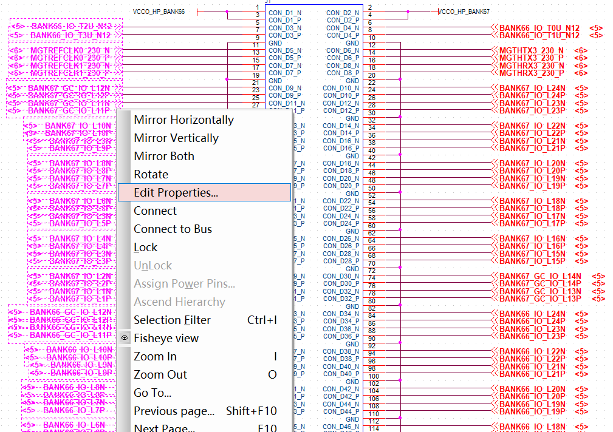

## Parse pstsnet

`parse_pstxnet_to_json` is used to parse the cadence pstxnet file and generate the pin along with the signals attached to.

In the json file, every FPGA IO has its connections with other components or connectors.

```json
 "BANK44_GC_IO_L5N": [
        "J2.126",
        "U1.AK14"
    ],
    "BANK44_GC_IO_L5P": [
        "J2.128",
        "U1.AK15"
    ],

```

## Swap connectors' pin assignment

After the PCB layput, some pins need to be swapped. In such a case, the script can boost the name reassignment process. But, some manual work is still required.

1. From the pcb layout netlist, we get the whole pin_json file via the script `pcb_bulter.py`
```python
pstxnet_file = "./mszu9/netlist-12-26/pstxnet.dat"
brd_file = "./mszu9/output/FPGA.txt"
json_file = "./mszu9/mszu9-pin.json"
file_cook = cook.FileCook(pstxnet_file, brd_file)

file_cook.parse_pstxnet_to_json(json_file)
file_cook.rule_check(json_file)
file_cook.filter_power(json_file)
```
2. In the schematic, the connector is divided into two parts, left and right, by default. Get the pin signals via "edit properties" by right clicking at the signal names, as shown in the picture. Then, copy all the select signals(ctrl+c+insert) to a file, named as `J1_source_pin_part_1.txt`.

3. In the `pin_butler.py`, change the part,  target_brd_filename, and index and execute the  `pin_butler.py`. `part` refers to the connector reference in the CIS CAD, such as "J1" and "J2" or any other name; `target_brd_filename` refers to the after-layout netlist, usually in txt format. such as J4.txt or J4_NEW.txt, where it contains the connector's signals; `index` refers to left or right, any value as you wish. After executing the `pin_butler.py`, a target file named `J1_target_pin_part_1.txt` will be generated.
``` python
part = "J4"
# the netlist from pab layout
target_brd_filename = "J4"
index = "2"
pin_file_path = './mszu9/netlist-2023-2-25'
```
4. Copy the signals generated in the step 3 and paste(shift+insert) back to the properties in step 2.

## DDR pin swap
The procedure of swapping PL DDR pins
1. Get the PL DDR signals of FPGA from the original schematic
2. According to the signals, get the pin location in FPGA via the `pin_bulter.py`
3. Based on the pin location, get the corresponding signals
4. Paste the signals to the schematic manually